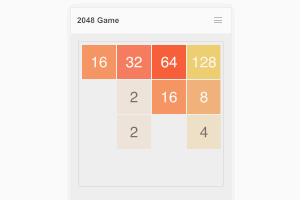

# 2048 Game

2048 is a single-player sliding block puzzle game. You need to
move blocks in order to combine the same tiles. The goal is to
reach 2048 or a maximum you can.

This is just another implementation of [2048 Game](https://github.com/gabrielecirulli/2048) initially written by Gabriele Cirulli.
Fun project to get my hands to work with some technologies.

Demo is deployed here: [https://megaboich.github.io/2048/](https://megaboich.github.io/2048/).

Used 3rd party technologies and assets:

- SVG manipulation and animation library [SVG.js](https://github.com/svgdotjs/svg.js)
- Icon font [Open iconic](https://github.com/iconic/open-iconic)
- CSS framework [Bulma](https://github.com/jgthms/bulma)
- [TypeScript](https://github.com/Microsoft/TypeScript)
- [Webpack](https://github.com/webpack/webpack)
